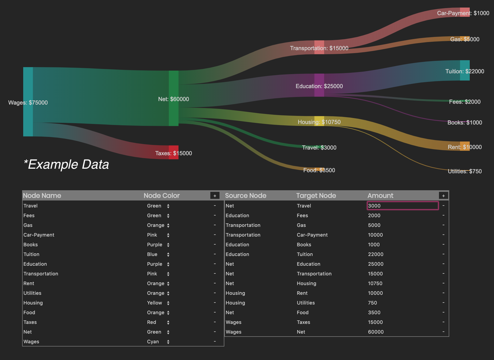

# BudgetFlow

A Full Stack Web App that anaylyzes the 'flow' of your expenses and visualizes your budget.

Constructs Sankey flow diagrams.

## Use

## Development

Dependencies: 
- Flask 
- D3.js 
- JQuery 

## Author

Noah Tigner

nzt@cs.uoregon.edu

References: Jarret Meyer's D3.js code for advanced sankey graphs
